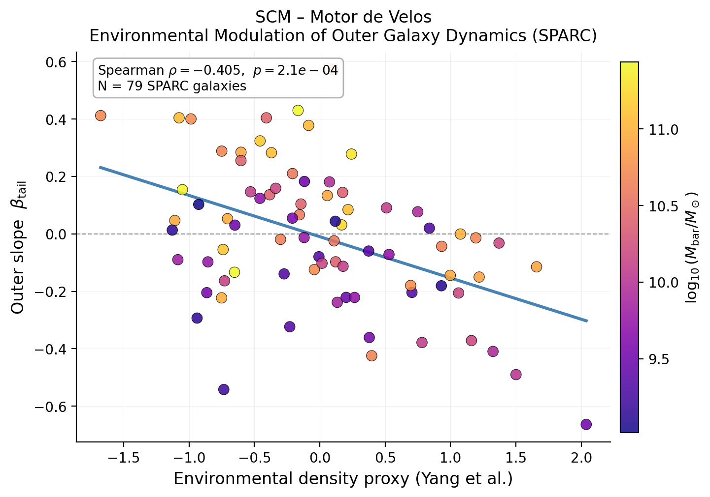
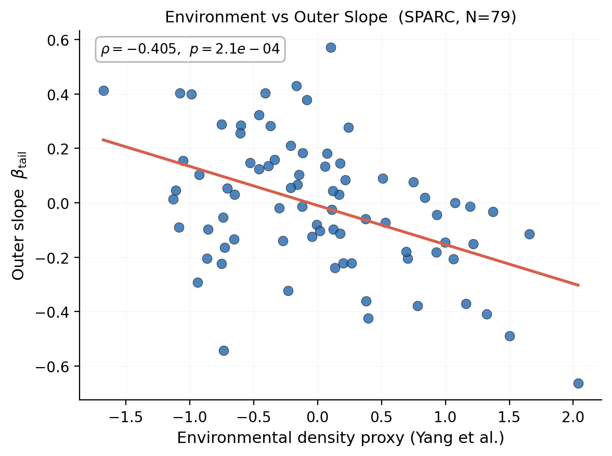
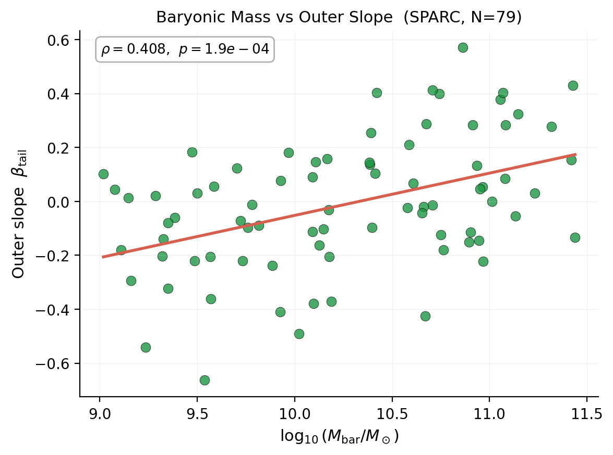
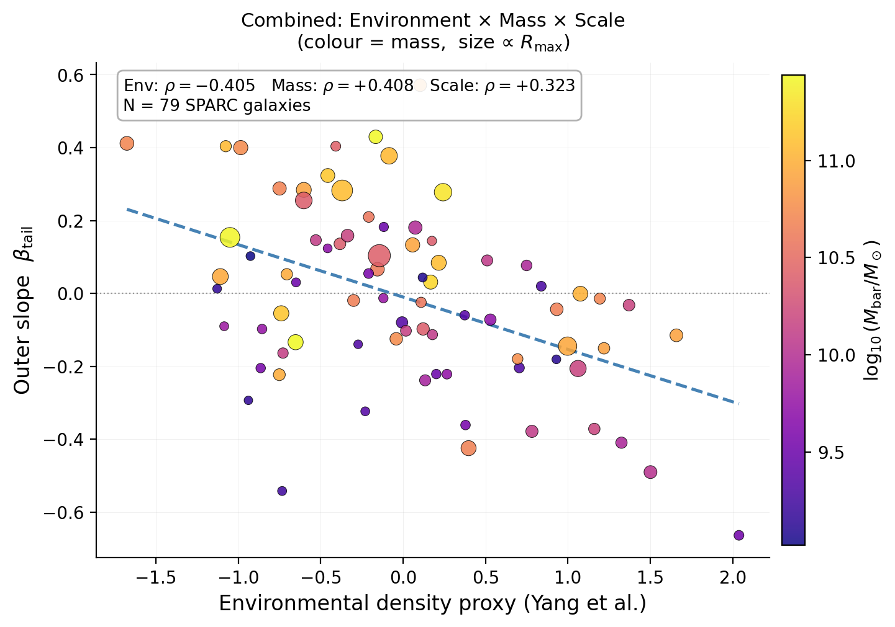

[](https://colab.research.google.com/github/sergiocamaramadrid-cyber/Motor-de-Velos-SCM/blob/main/notebooks/scm_reproducible.ipynb)

# SCM – Motor de Velos

## Environmental Modulation of Outer Galaxy Dynamics

We analyze SPARC galaxies (N = 79) and find that the outer slope of galaxy rotation curves is not universal.

---

## Main Result



**Figure 1** — Outer slope of galaxy rotation curves as a function of environmental density (Yang proxy). Points are color-coded by baryonic mass. A clear structure emerges: higher environmental density correlates with lower outer slopes, while higher mass shifts galaxies toward higher slopes.

---

## Key Results

### 1. Environmental Effect (Yang et al. proxy)
- Spearman ρ ≈ **−0.365**
- p ≈ **9.3 × 10⁻⁴**

→ Higher environmental density → **lower outer slope**

---

### 2. Mass Effect
- Spearman ρ ≈ **+0.406**
- p ≈ **2.0 × 10⁻⁴**

→ Higher mass → **higher outer slope**

---

### 3. Radial Scale (Rmax)
- Spearman ρ ≈ **+0.378**
- p ≈ **6.0 × 10⁻⁴**

→ Larger galaxies → **higher slope**

---

### 4. Gas Contribution
- Weak / non-significant in combined models
- Acts as a **secondary modulator**, not a driver

---

## Combined Interpretation

The outer slope is not governed by a single parameter but emerges from a coupled system:

```
slope_tail ≈ + mass − environment + scale
```

---

## Multi-Dataset Validation

### SPARC (main sample)
- Clear mass and environment trends

### LITTLE THINGS (low-mass regime)
- Inverted behavior:
  - velocity vs slope → negative correlation
- Indicates **regime transition**

### Gaia (Milky Way)
- No global slope detected
- Signal diluted due to mixed populations

---

## Physical Interpretation

- **Mass → internal gravitational driver**
- **Environment → external modulation / suppression**
- **Scale → geometric structure**
- **Gas → local dynamical adjustment**

This supports a **non-universal outer regime**.

---

## Core Insight

The apparent scatter in galaxy dynamics is not noise but the result of **mixed physical contributions**.

This framework "dissipates the fog" by separating:

- internal structure (mass)
- external influence (environment)
- geometric scale

---

## Figures

### Environment vs slope


### Mass vs slope


### Combined (mass-colored)


---

## Repository Structure

- `src/`: Core model implementations and analysis modules.
- `scripts/`: CLI-style analysis and pipeline scripts.
- `data/`: Data fixtures and catalog files (large raw datasets not versioned).
- `results/`: Generated outputs. Naming convention: `results/<module>/<artifact>-v<semver>.csv`
- `docs/`: Formal documentation, data contracts and validation protocols.
- `notebooks/`: Exploratory and validation notebooks.
- `tests/`: Unit and integration tests.

---

## Installation

```bash
git clone https://github.com/sergiocamaramadrid-cyber/Motor-de-Velos-SCM.git
cd Motor-de-Velos-SCM
python -m venv .venv
source .venv/bin/activate     # Windows: .venv\Scripts\activate
pip install --upgrade pip
pip install -r requirements.txt
```

Run tests: `pytest`

---

## Data Policy

Raw datasets (e.g., SPARC, LITTLE THINGS) are **not versioned**.  
Download and preprocessing scripts are provided for reproducibility.  
See `docs/SPARC_EXPECTED_BEHAVIOUR.md` for the formal data contract.

---

## Citation

See `CITATION.cff` and the Zenodo archive (DOI when available).

---

## License

Refer to the LICENSE file.

---

## Author

Sergio Cámara Madrid  
Independent Researcher  
Framework: **SCM – Motor de Velos**  
Repository: https://github.com/sergiocamaramadrid-cyber/Motor-de-Velos-SCM